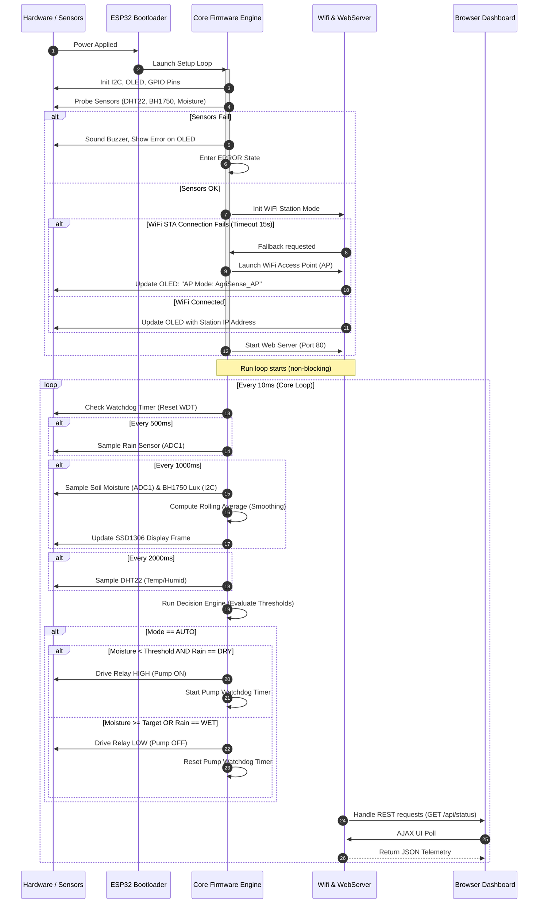
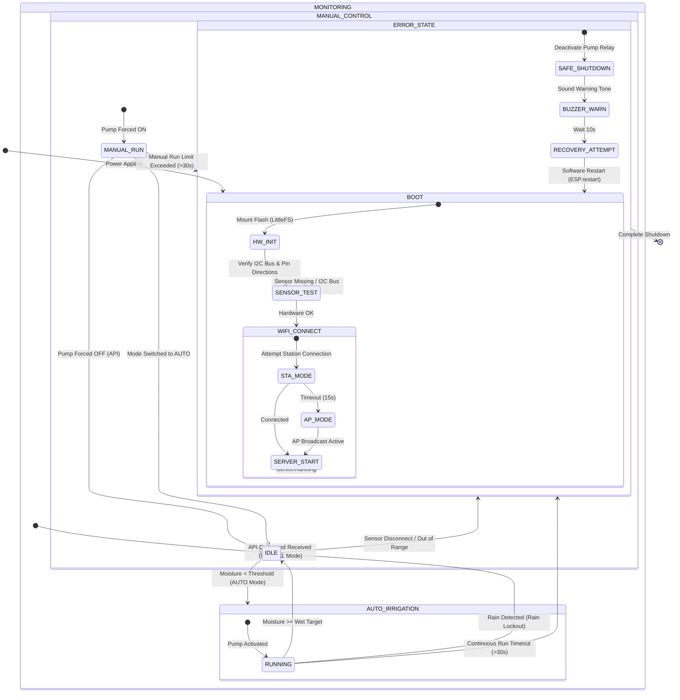

# 2. System Architecture & Workflows

## 2.1 Software Architecture Layers
The AgriSense firmware is structured in five decoupled software layers to ensure maintainability, testability, and isolated component responsibilities.

```
+-------------------------------------------------------------+
|                     Dashboard Layer (UI)                    |
|                HTML5 / CSS3 / Vanilla JavaScript            |
+-------------------------------------------------------------+
                              | REST API (JSON)
+-------------------------------------------------------------+
|                  Communication Layer                        |
|       WebServer / WiFiManager / REST API Endpoints          |
+-------------------------------------------------------------+
                              | Reads/Writes State
+-------------------------------------------------------------+
|                   Business Logic Layer                      |
|         Decision Engine / AlarmManager / State Machine       |
+-------------------------------------------------------------+
                              | Commands Drivers
+-------------------------------------------------------------+
|                     Driver / Hardware Layer                 |
| SensorManager / PumpController / DisplayManager (I2C/GPIO)  |
+-------------------------------------------------------------+
                              | Unified Pins & Defines
+-------------------------------------------------------------+
|                  Configuration Layer                        |
|                     config.h / pins.h                       |
+-------------------------------------------------------------+
```

### Layer Responsibilities
1.  **Configuration Layer (`config.h`, `pins.h`)**: Centralized compilation constants. Declares physical ESP32 pin bindings, sensor calibration values, auto-mode moisture thresholds, default WiFi credentials, and safety timers.
2.  **Driver Layer (`sensor_manager`, `pump_controller`, `display_manager`)**: Abstracted hardware interaction. Wraps sensor libraries (DHT, BH1750), handles non-blocking analog reading smoothing (rolling averages), operates physical relay GPIOs, and manages SSD1306 frame rendering.
3.  **Business Logic Layer (`alarm_manager`, State Machine)**: Decides state transitions. Validates sensor ranges, compares current soil moisture against thresholds, monitors pump running durations, tracks system safety states, and triggers alarm behaviors.
4.  **Communication Layer (`wifi_manager`, `web_server`)**: Manages external network interfaces. Establishes station connection or boots local Access Point fallback, processes incoming REST HTTP requests, parses incoming control variables, and sends JSON response bodies.
5.  **Dashboard Layer (`index.html`, `style.css`, `script.js`)**: Executes in client browser. Performs AJAX polling of ESP32 REST API, renders live gauges, provides interactive toggles, updates network status indicators, and logs local alarm events.

---

## 2.2 System Architecture Diagram
The flow of telemetry, network commands, and output control across the hardware boundary is visualised below:

```mermaid
graph TD
    subgraph BrowserClient["Browser Client (Mobile/PC)"]
        UI["Web Dashboard UI"]
        AJAX["REST Client (JS Fetch)"]
    end

    subgraph Network["Network Layer"]
        WiFi["Wi-Fi connection (Station / AP)"]
    end

    subgraph ESP32["ESP32 Microcontroller"]
        WebServer["REST HTTP Server"]
        Config["Configuration & Pins"]
        
        subgraph Logic["Core Firmware Engine"]
            SM["State Machine"]
            DE["Decision Engine"]
            AM["Alarm Manager"]
        end

        subgraph Drivers["Driver Layer"]
            Sensors["Sensor Manager (DHT22, Soil, Rain, BH1750)"]
            Pump["Pump Controller (Relay Drive)"]
            OLED["Display Manager (SSD1306)"]
        end
    end

    subgraph HardwareOutputs["Physical Hardware Outputs"]
        Relay["1-Channel Opto-isolated Relay"]
        Motor["Mini DC Water Pump"]
        Buzzer["Active Buzzer"]
        Screen["0.96 OLED Display"]
    end

    subgraph HardwareInputs["Physical Sensors"]
        DHT["DHT22 (Temp & Hum)"]
        Soil["Capacitive Soil Probe"]
        Rain["Rain Sensor Board"]
        Light["BH1750 Lux Sensor"]
    end

    %% Wiring connections
    UI <=> AJAX
    AJAX <=>|HTTP Requests / JSON| WiFi
    WiFi <=>|TCP Port 80| WebServer
    WebServer <=>|Read Status / Write Config| SM
    SM === DE
    DE === AM
    DE -->|Control Signals| Pump
    DE -->|Render Frames| OLED
    Sensors -->|Raw Telemetry| DE
    
    %% Drivers to physical components
    Pump -->|GPIO Control| Relay
    Relay -->|DC Power Switching| Motor
    AM -->|GPIO PWM/High| Buzzer
    OLED -->|I2C SDA/SCL| Screen
    
    %% Physical sensors to drivers
    DHT -->|Digital Input| Sensors
    Soil -->|Analog ADC1| Sensors
    Rain -->|Analog ADC1| Sensors
    Light -->|I2C SDA/SCL| Sensors
```

---

## 2.3 System Workflow
The sequential execution sequence after power delivery is illustrated below:



---

## 2.4 System State Machine
The system operates within defined states to ensure predictable behavior, especially during hardware faults or manual intervention:


