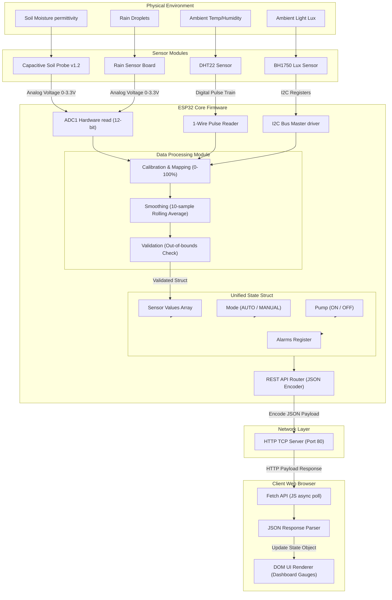

# 7. Data Flow & Processing Pipeline

## 7.1 Data Flow Diagram
The flow of telemetry from physical sensors through the ESP32 processing stages to the browser dashboard is shown below:



---

## 7.2 Telemetry Conversion Pipeline

### 1. Soil Moisture Mapping
The capacitive soil moisture probe outputs an analog voltage between 1.2V (fully saturated soil) and 2.8V (completely dry air).
*   **ADC Conversion**: The ESP32 converts this voltage into a 12-bit digital value (0 to 4095).
    *   $\text{ADC}_{\text{dry}} \approx 3100$ (corresponds to ~2.5V in dry air)
    *   $\text{ADC}_{\text{wet}} \approx 1400$ (corresponds to ~1.1V fully submerged)
*   **Linear Mapping Formula**:
    $$\text{Moisture \%} = \text{constrain}\left( \frac{\text{ADC}_{\text{dry}} - \text{ADC}_{\text{raw}}}{\text{ADC}_{\text{dry}} - \text{ADC}_{\text{wet}}} \times 100,\ 0,\ 100 \right)$$

### 2. Rain Sensor Calibration
The rain sensor probe uses a voltage comparator circuit. 
*   **ADC Range Mapping**:
    *   $\text{ADC} > 3500$: Dry (No rainfall)
    *   $1500 < \text{ADC} \le 3500$: Moderate Rain
    *   $\text{ADC} \le 1500$: Heavy Rain / Water immersion

### 3. Data Smoothing & Noise Reduction
To prevent transient voltage dips (caused by motor activations) from triggering false sensor readings, all analog inputs pass through a **rolling average filter**:
*   An array of size 10 stores the last 10 samples.
*   Every 100ms, the oldest sample is replaced with a new reading.
*   The system uses the computed average of this array for all decision logic checks.

---

## 7.3 Data Serialization (REST JSON Schema)
When requested, the communication layer encodes the active system states into a minified JSON response body:

```json
{
  "timestamp": 178263729,
  "system": {
    "mode": "AUTO",
    "pump": "OFF",
    "uptime_s": 3624,
    "wifi_rssi": -65
  },
  "sensors": {
    "moisture_pct": 42.5,
    "temperature_c": 26.8,
    "humidity_pct": 55.2,
    "light_lux": 420,
    "rain_state": "DRY"
  },
  "alarms": {
    "sensor_fault": false,
    "pump_timeout": false,
    "low_battery": false
  }
}
```
This payload is read by the dashboard's JavaScript engine to update the user interface.
